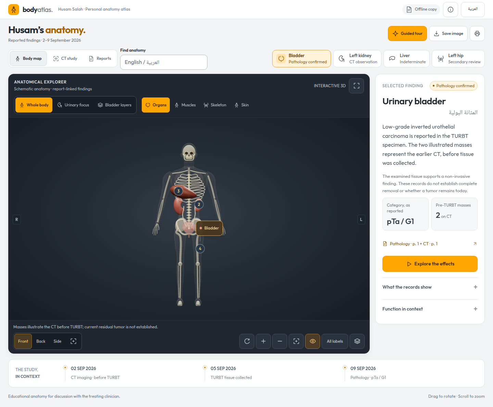

# Husam Body Atlas

An offline, bilingual 3D anatomy viewer that connects Husam's supplied reports with educational anatomy, a bladder-wall cutaway, and CT-derived surfaces and image previews.

**[Open the live 3D atlas](https://husam05.github.io/husam-body-atlas/)**

The repository and hosted site are public and contain identifiable medical information, original reports, and CT-derived assets.



## Open the atlas

Use the [live website](https://husam05.github.io/husam-body-atlas/) in a modern browser. The GitHub repository page is for browsing source files; the website runs the interactive viewer.

For offline use, clone or download the complete repository, then open **[Husam-3D.html](Husam-3D.html)** in Chrome or Edge. The viewer runs locally without a server or an internet connection. Keep the folder structure intact so fonts, CT assets, research, and report links load correctly. GitHub's file preview does not run the application.

The interface supports English and Arabic, organ selection, anatomical layers, controlled camera transitions, a guided tour, image export, printing, and mobile viewing. The full-body model and bladder cutaway are educational illustrations; the separate CT surfaces show only the scanned region and are not clinical organ or tumor segmentations.

## Project files

- [Application guide](husam-body/README.md): controls, source chronology, medical limitations, and development instructions.
- [Interactive atlas](husam-body/index.html): prebuilt offline application.
- [Research PDF](husam-body/research/design-evidence.pdf): cited medical and design rationale.
- [Source code](husam-body/src/): anatomy, findings, motion, and interface.
- [Tests](husam-body/tests/): motion and browser regression checks.
- The three original PDFs are included beside the launcher so source links work.

The original CT ZIP archives, temporary scan crops, dependencies, historical design boards, and third-party reference screenshots are excluded. The generated assets needed to explore the CT study are included. Rebuilding those assets requires the original `Study0908095422986.zip` beside the launcher.

## Development

Use Node.js 20 or newer:

```sh
cd husam-body
npm ci
npm run build
npm test
```

Browser tests use `/usr/bin/google-chrome` by default. Set `CHROME_PATH` to another installed Chrome or Chromium executable when necessary. Run `npm run research` to rebuild the research HTML, or `npm run research -- --pdf` to also generate its PDF using local Chrome.

The prebuilt application needs no dependency installation. Its reports do not establish current residual tumor, numerical organ efficiency, or an overall cancer stage; the viewer preserves the source dates and stated uncertainties.

## Website deployment

GitHub Pages publishes the `main` branch from the repository root. The root `index.html` opens the atlas in `husam-body/`, preserving relative asset and report links. `.nojekyll` serves the prebuilt files without Jekyll processing. Push updates to `main` after rebuilding the application to update the live site.
