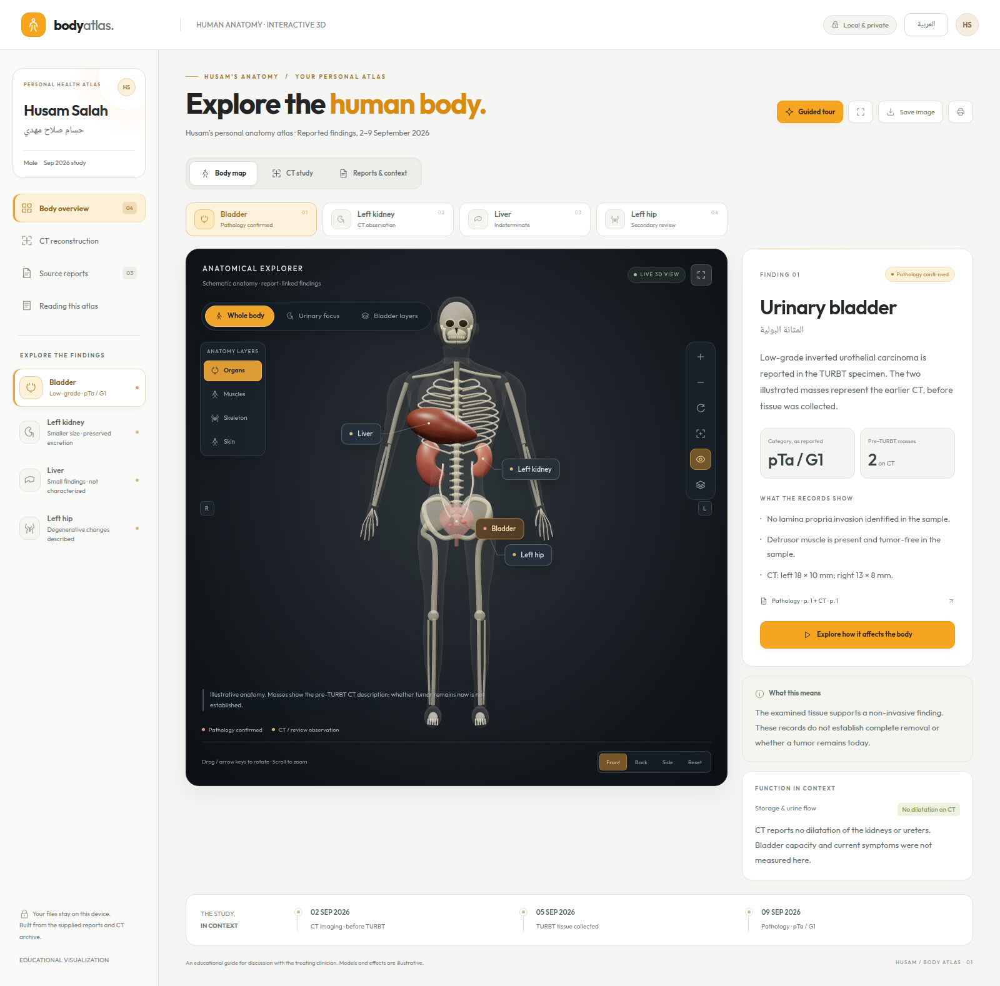

# Medical visualization design evidence

The atlas connects reported anatomical findings with an educational three-dimensional body, a conceptual bladder-wall cutaway, and a separate reconstruction of the actual CT coverage. Its visual credibility depends on clear source attribution, stable anatomical orientation, and explicit limits on what images or tissue samples establish.

The supplied pathology reports low-grade inverted urothelial carcinoma, with pTa / G1 preserved as written. No lamina propria invasion was identified and detrusor muscle was present and tumor-free in the examined specimen. Earlier CT findings must remain dated before TURBT. Liver findings remain indeterminate; the left-hip observation belongs to the secondary Arabic review. Numerical organ efficiency cannot be inferred from the supplied records.

The design therefore emphasizes three complementary views: the body for location, the enlarged wall layers for explanation, and the CT surfaces for the scanned anatomy. Colors and illumination identify selection and evidence categories; they are not severity measurements. A more realistic image does not establish a more certain diagnosis.

## Interface and motion design

The visual direction gives the human body the largest and earliest useful area of the screen. Anatomy 3D Atlas provides a relevant interaction reference: rotation, zoom, selection, isolation, pins, layers, centering, and transparency all support deliberate inspection of anatomy. Its light page surroundings and dark anatomical imagery inform the atlas’s white, gray, charcoal, and orange palette.[^d1] The Mozaweb male-body scene contributes a clear separation of skin, skeletal muscles, skeleton, and organ systems.[^d2] These are references for presentation and navigation; the local atlas retains its own schematic geometry and clinical annotations.

### Layout and readable evidence

The principal layout decision is a compact patient header followed by one finding selector and the viewer. A 320 px finding panel accompanies the viewer at widths of 1100 px and above. Smaller layouts place a concise finding summary beneath the viewer, with complete detail available in a dialog. The summary retains the selected organ, evidence category, source, and relevant uncertainty so the shorter layout does not remove the context needed to interpret the anatomy.

Scene controls belong above the canvas; camera manipulation belongs below it. General body layers appear only in Whole body mode. The selected finding receives a full annotation while other findings use compact selectable pins. An explicit option reveals all labels. This makes the initial view quieter while preserving access to the same information. Pin positions remain attached to their anatomical anchors; visual spacing must not change a finding’s implied location.

The chosen reading sizes are 16 px for English clinical text and 18 px for Arabic clinical text. Important controls have a 44 px activation target. These are product decisions, not claimed WCAG font-size requirements or a statement of full conformance. Arabic changes document language, reading order, and control alignment without reflecting the anatomical model. Latin classifications and measurements need isolated left-to-right spans. W3C distinguishes language from direction and recommends declaring direction in HTML.[^d3]

### Controlled movement

Camera presets and organ focus use a 600 ms transition around the target. An orbital route between front and back maintains an exterior view; straight interpolation across opposite camera positions can cross the body. Button zoom uses 180 ms. Finding-panel changes use 180 ms, and scene crossfades use 220 ms. These durations are implementation choices for a brief, legible response; the sources do not establish them as medically or experimentally optimal.

A new selection replaces an unfinished transition. Direct dragging and keyboard movement interrupt camera animation. Expanding the viewer preserves its orientation. During a scene crossfade, labels wait until the new scene is available, preventing a caption for one view from appearing over another. The canvas remains mounted during selections and keyboard focus stays with the active control. These behaviors protect continuity when someone explores several findings quickly.

Reduced-motion preferences apply immediately, including when the operating-system preference changes while the atlas is open. Active transitions finish, automatic movement stops, and static explanatory content remains accessible. Manual camera controls continue to work. W3C’s Animation from Interactions criterion addresses disabling nonessential interaction-triggered motion; its discussion describes potential discomfort from movement. This is a rationale for offering a stable view, not a claim that the full application has undergone a conformance assessment.[^d4]

### Rendering and interpretive limits

The renderer requests frames when state, camera position, layout, or visible effects change, and continues while damping or a deliberate animation requires them. It stops when the view settles. Three.js documents this event-driven approach and the need to coalesce requests when controls with damping produce further change events.[^d5] The practical aim is to avoid unnecessary work while a person reads a stationary finding. No battery-life or hardware-performance improvement is quantified here.

Shell opacity changes are separate from presentation selection; annotation measurements are cached between relevant layout changes. Together with a persistent canvas, these decisions reduce repeated work during ordinary navigation. They do not increase the resolution, accuracy, or clinical validation of the underlying anatomy or CT surfaces.

All transitions represent interface navigation. They do not portray tumor shrinkage, progression, postoperative clearance, measured urine flow, or changes in organ efficiency. Natural tissue colors and additional body layers remain educational context. The dated evidence and specimen qualifiers described below remain the basis for the clinical text.

### Before and after

The earlier desktop preview shows the larger introductory region and repeated navigation that competed with the anatomy. The enhanced previews document the compact header, viewer emphasis, mobile summary, and Arabic reading order. These screenshots are local interface records, not new medical evidence.[^d6]

| Aspect | Earlier interface | Enhanced interface |
|---|---|---|
| First anatomy view | Viewer began about 383 px from the top at 1440 × 900 and 457 px at 320 × 900. | Viewer begins at 202.8 px at 1440 px width and 242.8 px at 320 px width, both in English. |
| Navigation | Finding selection repeated in separate regions. | One finding selector; full detail beside the viewer or in a dialog. |
| Readability | Some compact mobile labels were below 10 px. | Clinical text at 16 px English / 18 px Arabic; essential context remains readable. |
| Camera continuity | Opposite presets could interpolate across the body. | Exterior orbital route with immediate interruption. |
| Static viewing | Frames continued while the image was idle. | Rendering settles when no visible change is needed. |
| Keyboard continuity | Replacing the interface could discard focused controls. | Canvas and control focus survive selection updates. |

The English 390 px layout begins the viewer at 235.2 px; the Arabic 320 px and 390 px layouts begin it at 250.2 px. All nine recorded layouts have no page overflow and no tested primary controls below the 44 px target. These are local CSS-pixel measurements at specified viewport sizes, not cross-device performance measurements.

The [interface regression results](../tests/interface-results.json) record 15 passed groups covering focus continuity, orbital camera travel and interruption, stable scene changes, expanded-view orientation, idle rendering, dynamic reduced motion, mobile detail access, printing, and offline operation without browser errors or remote requests. The paired previews document appearance; these targeted checks do not establish full accessibility conformance or clinical validation.

<figure class="comparison">

Earlier desktop interface

Enhanced desktop interface

<figcaption>Figure 1. Local interface comparison. Both views use illustrative anatomy; neither is an organ segmentation.</figcaption></figure>

The [phone preview](../preview-enhanced-mobile.png), [Arabic preview](../preview-enhanced-arabic.png), and [expanded-view preview](../preview-enhanced-immersive.png) provide full-size records of the corresponding layouts.

## Clinical interpretation and visual constraints

**The artwork should communicate one central distinction:** the body map illustrates findings described on the CT before TURBT, while the later tissue report supplies the bladder diagnosis. The records support a low-grade, non-invasive finding in the examined specimen. They do not establish current residual disease, complete removal, whole-body cancer stage, or numerical organ efficiency. These limits belong beside the relevant visuals and in exported images.

**The local evidence has three different roles.**

| Record | Date and pages | What it contributes |
|---|---|---|
| [حسام صلاح مهدي.pdf](../../حسام%20صلاح%20مهدي.pdf), R1 | Specimen collected 5 September; reported 9 September 2026; p. 1 | Signed pathology report, read from its scanned page. The primary source for the tissue diagnosis and statements about invasion in the sample. |
| [report.pdf](../../report.pdf), R2 | CT performed 2 September; report issued 3 September 2026; pp. 1–2 | Original radiology report. Source for lesion sizes, anatomical relationships, renal observations, liver uncertainty, and CT limitations. |
| [مراجعة_عربية_لدراسة_البطن_والحوض.pdf](../../مراجعة_عربية_لدراسة_البطن_والحوض.pdf), R3 | Reviews the 2 September study; no separate issue date established; pp. 1–3 | Secondary interpretation. Adds the left-hip observation and discusses imaging limitations. It is not an addendum signed by the original radiologist. |

The supplied Study0908095422986.zip underlies the separate CT reconstruction. A surface extracted from image density should be described by its reconstruction method; it should not acquire a tumor label merely because it appears in a medical scene.

**Preserve the sequence of events in every version.** R2 p. 1 describes two enhancing masses inside the bladder near the ureteric entrances. The patient-left mass measures approximately 18 × 10 mm, with a narrow pedicle up to approximately 5 mm. The patient-right mass measures approximately 13 × 8 mm, with an attachment up to approximately 12 mm. These measurements belong to the 2 September CT, before the 5 September tissue collection documented in R1. The pathology report arrived on 9 September. [R2](../../report.pdf), p. 1; [R1](../../حسام%20صلاح%20مهدي.pdf), p. 1.

A three-point timeline should remain visible: CT → TURBT specimen collection → pathology result. Do not animate the masses shrinking or disappearing after TURBT: the supplied documents do not establish the completeness of resection or present appearance. The preferred caption is “CT findings before TURBT; current residual disease is not established.” In Arabic: “نتائج التصوير قبل الاستئصال؛ لا تحدد الوثائق وجود ورم متبقٍ حالياً.” EAU describes accurate diagnosis and removal of visible lesions as goals of TURBT; a procedural goal is not evidence that a particular patient’s removal was complete. [^m1].

**Represent the pathology faithfully without assigning an overall stage.** R1 reports low-grade inverted urothelial carcinoma with a predominantly inverted/endophytic growth pattern. It identifies no lamina propria invasion and reports detrusor muscle present and tumor-free. The report’s stated category is pTa / G1. Preserve that notation with “as reported,” alongside the plain-language diagnosis. [R1](../../حسام%20صلاح%20مهدي.pdf), p. 1.

Ta is a primary-tumor category describing non-invasive papillary carcinoma; T1 describes invasion into subepithelial connective tissue, and T2 describes muscle invasion. Regional nodes and distant metastasis have separate N and M categories. Therefore pTa alone must not become a newly assigned overall stage in this artwork. Also distinguish grade from anatomical extent: the EAU describes G1–G3 and modern low/high-grade systems separately. The combined notation in R1 should be reproduced rather than silently standardized. [^m2].

NCI’s patient explanation distinguishes cell grade from cancer stage and shows the lining, supporting tissue, and muscle as separate anatomical layers. This is suitable for a general explanatory inset. It does not permit a claim that the entire bladder or whole body has been microscopically examined. [^m3].

**Inverted growth is an architectural description, not an instruction to draw invasion.** The report describes irregular trabeculae and solid nests but explicitly finds no convincing destructive stromal invasion in the deeper sections examined. A realistic-looking microscopic illustration could mislead if it places detached tumor cells across supporting tissue or through muscle. No histology slides are supplied from which to reproduce the actual microscopic geometry. [R1](../../حسام%20صلاح%20مهدي.pdf), p. 1.

NCI’s SEER teaching taxonomy includes low-grade papillary urothelial carcinoma with an inverted growth pattern among non-invasive histologies. ICCR’s current TURBT guide explains that inverted lesions can complicate invasion assessment and that invasion requires unequivocal evidence. These sources support separating architectural appearance from destructive invasion; they do not replace this patient’s pathologist. [^m4]; [^m5].

For the design, favor a clearly schematic three-layer inset with adjacent report text. If an epithelial fold is illustrated to explain inward architecture, keep it visibly bounded and label it a conceptual diagram. Avoid a penetrating red arrow. The clinically meaningful label is “No invasion identified in the examined supporting tissue; sampled muscle tumor-free,” not an invented microscopic reconstruction.

**Keep sample qualifiers attached to the reassuring findings.** R1 evaluates submitted tissue; it does not document a whole-bladder mapping study. Use “in the examined sample” on both supporting-tissue and muscle labels. EAU identifies the presence of detrusor muscle as information about specimen/resection quality. ICCR separately records muscle presence and extent of invasion, and emphasizes limits on staging from biopsy/TUR material. Together, these support careful specimen-level wording. [^m1]; [^m5].

Similarly, R2’s absence of obvious extravesical extension, significant lymphadenopathy, and destructive bone lesions is a CT observation. Avoid “no spread anywhere” or a green whole-body clearance badge. The pathology’s non-invasive finding is valuable without expanding it beyond the tissue examined. [R2](../../report.pdf), pp. 1–2.

**Explain urinary function without inventing efficiency.** NIDDK describes kidneys filtering blood, ureters transporting urine, and the bladder storing urine. A directional animation can teach this route. Particle speed, quantity, and brightness must remain aesthetic choices with a caption stating that flow is illustrative, not measured. [^m6].

R2 describes the left kidney as approximately 90 × 45 × 42 mm, with mild parenchymal thinning and a lobulated outline. The right is approximately 118 × 70 mm. Both excrete contrast normally, without collecting-system dilatation or stones. Use 9.0 cm and 11.8 cm as reported lengths; their ratio is not a split-function calculation. The cause of the size difference is not established by these records. [R2](../../report.pdf), p. 1; [R3](../../مراجعة_عربية_لدراسة_البطن_والحوض.pdf), pp. 1, 3.

Blood-based filtration assessment and urinary albumin testing address kidney function and damage. No creatinine, eGFR, urine-albumin result, or split renal-function study is supplied here. Consequently “contrast excretion preserved on CT” is supported, while “left kidney 76% efficient” or “body efficiency 92%” is fabricated. Do not give the liver, bladder, or hip a performance percentage either. [^m7].

**Retain the liver’s uncertainty.** R2 describes a few small low-density liver findings, the largest approximately 7.7 mm. It considers small benign cystic lesions but cannot confidently exclude metastatic deposits. Thus the artwork should say “Small liver findings — indeterminate.” It must not transform them into diagnosed cysts, confirmed metastases, or liver failure. The later bladder pathology does not characterize the liver lesions. No quantified impact on liver function appears in these documents. [R2](../../report.pdf), pp. 1–2.

Use amber hollow markers with “illustrative position; enlarged for visibility.” The written report does not supply enough location detail for exact lesion coordinates. Do not draw connecting arrows from bladder to liver. Mention further characterization only as an existing report recommendation: R2 suggests liver MRI or imaging follow-up depending on the clinical situation; the artwork should not prescribe a new investigation schedule.

**Present the hip as a secondary-review observation.** R3 describes moderate-to-severe chronic left-hip degeneration, including joint-space narrowing, sclerosis, subchondral cysts, osteophytes, and mild remodeling. This is absent from the original radiologist’s report. Use an amber or dashed callout labeled “Secondary review — specialist confirmation,” including in exports. Do not present the hip as a biopsy-confirmed finding or as spread from the bladder. [R3](../../مراجعة_عربية_لدراسة_البطن_والحوض.pdf), pp. 1, 3.

NIAMS explains that osteoarthritis can involve several joint tissues and can cause pain, stiffness, and restricted movement. These are possible effects, not documented symptoms in Husam. An explanatory inset may compare ordinary joint spacing with schematic narrowing, but it must not claim a measured loss of walking ability or predict disability. [^m8].

**Separate possible symptoms from observed findings.** Bladder cancer can be associated with blood in urine, urgency, frequent urination, or burning; these symptoms also occur in other conditions. Husam’s symptom history is not established by the supplied reports. Use an optional panel titled “Possible effects — symptoms not documented,” with restrained illustrations and no automatic bleeding animation. [^m9].

**Use the visual hierarchy to preserve evidence.** The proposed palette is a design decision: warm coral for the pathology-linked bladder focus, amber for uncertain/secondary observations, and muted teal for contextual anatomy. Color must be accompanied by text, not treated as a severity score. Front views place the patient’s right on the viewer’s left; rotating views need stable anatomical laterality. Show two CT-described bladder masses, with the patient-left one larger. Do not add a third lesion, obstruction, vessel invasion, or diseased organs absent from the reports.

A full-body shell is illustrative anatomy. Actual CT-derived surfaces should appear in a separate, clearly labeled study view restricted to scanned coverage. Dense-tissue thresholding does not constitute tumor segmentation. Every saved image should retain its model type, date context, selected finding, and uncertainty. A hip export without its secondary-source label or a liver export without “indeterminate” loses essential evidence even when the interactive screen is correct.

| Essential bilingual label | Recommended wording |
|---|---|
| Model type | Illustrative anatomy / تشريح توضيحي |
| Reported category | pTa / G1, as reported / pTa / G1 كما ورد في التقرير |
| Sample scope | In the examined tissue sample / في العينة النسيجية المفحوصة |
| Liver | Indeterminate liver findings / بؤر كبدية غير محددة الطبيعة |
| Hip | Secondary review observation / ملاحظة من المراجعة الثانوية |
| Function | Function percentage not established / نسبة الكفاءة غير محددة |

## Visualization and interaction
A stronger atlas should make anatomy easier to explore while making the origin, date, and limits of each statement easier to recognize. Its principal improvement should be a clear connection between an organ, a written finding, and its source. More realistic lighting can improve appearance; it does not establish that a displayed lesion was segmented from this patient’s images.

The existing local assets support two complementary experiences: a complete schematic human body and a CT-derived reconstruction of the scanned region. The reconstruction uses 98 axial images, 0.7265625 mm in-plane spacing, 5 mm between slice centers, and 485 mm between the first and last image centers. Twelve JPEG previews sample that series. These are properties of the supplied assets, not measures of organ performance.[^v1]

## 1. Make evidence visible at the point of interpretation

Give each finding a persistent text badge identifying its basis: “Pathology report,” “CT report,” or “Secondary review.” Add the document date and a short statement of what remains unresolved. Pair each badge with a distinct shape or icon. The recommended vocabulary is an editorial design judgment; the requirement to communicate meaningful distinctions through more than color is supported by WCAG 2.2.[^v2]

Keep evidence source and certainty as separate fields. A pathology result describes examined tissue; a CT description describes an imaging observation; a secondary review has a different provenance. Collapsing these categories into an unlabeled green-to-red scale would hide those differences. “Not established from these records” should appear as ordinary readable content where needed. Do not invent confidence percentages or body-efficiency gauges.

Place the study timeline beside the findings. Use explicit dated statements when earlier imaging and later tissue findings coexist. Selecting a timeline event may highlight its associated text, but should not morph a tumor into a smaller or absent tumor unless a source establishes that change. Label schematic markers as schematic in the viewer itself. A source drawer should show filename, relevant page or section, and whether the statement is quoted, summarized, or explanatory.

## 2. Preserve the boundary between surface extraction and anatomy

Retain the label “Dense tissue surface” for the CT layer extracted above 300 HU. In 3D Slicer, thresholding selects voxels by intensity; other editing tools refine regions. Its documentation explains that smoothing can remove details, fill gaps, or shrink a segment. Consequently, the present threshold, component filtering, filling, smoothing, and mesh reduction should remain visible in provenance. They do not establish a clinician-reviewed segmentation of bone, organs, or tumors.[^v3]

DICOM represents segmentation as derived data and provides attributes describing the segment and the algorithm used to generate it. This is a useful model for the atlas’s provenance record, although the current GLB files are not DICOM segmentation objects. Do not describe them as DICOM SEG exports or imply clinical validation from their file format.[^v4]

Show a short CT summary directly beneath the viewer: selected series, acquisition date, image count, slice interval, coverage, and surface method. Keep the detailed metadata link for technical inspection. A coverage indicator on the schematic body may identify the approximate scanned region, provided it is explicitly an overview and does not suggest exact registration between the two models.

## 3. Make orientation and slice correspondence dependable

DICOM defines image position, orientation, and pixel spacing in patient coordinates. For a human, increasing coordinates point toward patient left, posterior, and head. Slice thickness and spacing between image centers are distinct attributes. Series names and instance numbers are insufficient substitutes for these geometric fields.[^v5]

The assets already record a centered coordinate transform with positive X toward patient left, positive Y toward the head, and positive Z toward the front. Preserve that transform when adding camera presets, clipping, or slice markers. Show a camera-linked orientation indicator rather than fixed screen-edge letters that become misleading after arbitrary rotation.

Add previous/next preview buttons and an explicit “sample 7 of 12” indicator. Keep the source instance and window settings nearby. The linked plane should reflect the preview’s stored physical position. A future full slice browser should use the source pixels; changing the brightness of an already windowed JPEG cannot recover clipped source values. DICOM defines the stored-pixel rescale operation separately from subsequent display transformations.[^v6]

## 4. Improve legibility before adding visual complexity

The color ratios in this section describe the original stylesheet audit. They identify earlier design weaknesses and are not measurements of the enhanced interface. The interface section above describes the current reading-size and layout decisions.

WCAG requires at least 4.5:1 contrast for ordinary text and 3:1 for qualifying large text. The original palette includes muted text at approximately 3.71:1 on the paper background, metric labels at 3.10:1 on white, and function notes at 3.02:1 on their light background. These computed CSS pairs identify specific colors to darken; they are not a complete accessibility audit.[^v7]

Use approximately 16 px for explanatory paragraphs and 13–14 px for essential metadata as a product recommendation, not a WCAG minimum font size. Keep lengthy explanations outside the canvas. Essential labels should remain readable when the model rotates behind them. Increase paragraph spacing and reserve strong accent color for selection or meaningful status.

Required controls and graphical distinctions generally need 3:1 contrast against adjacent colors. The original focus outline is about 2.33:1 against white, so a darker outline is advisable. Check it on both light panels and the dark viewer. A soft border may remain decorative, but the selected organ, keyboard focus, and control boundaries must be discoverable.[^v8]

## 5. Provide complete alternatives to dragging and animation

Front, back, side, reset, and zoom buttons are a useful foundation. Add rotate-left/right and tilt-up/down buttons to reach intermediate views without dragging. Add pan alternatives if unrestricted panning remains available. WCAG’s dragging criterion requires a single-pointer alternative; keyboard access is a separate requirement, so arrow-key support alone does not settle both.[^v9][^v10]

Use native buttons with accessible names, clear pressed states, and visible focus. Give important controls approximately 44 px activation areas where space permits. WCAG 2.2’s AA minimum is 24 by 24 CSS pixels, with defined exceptions; 44 px is the atlas’s usability target.[^v11]

Keep auto-rotation off initially. Provide one obvious pause control for all explanatory motion. Honor reduced-motion preferences in every camera transition, including focus-on-organ, and in flow effects. WCAG requires pause, stop, or hide controls for qualifying automatically starting movement lasting more than five seconds. The broader recommendation to minimize optional movement also addresses reading comfort.[^v12]

The HTML finding panel should contain the useful meaning conveyed by the model. A canvas label alone is insufficient as an equivalent to a complex visualization; readers need the selected anatomy, findings, provenance, and limits in text. Announce deliberate selection and slice changes briefly without announcing every animation frame.[^v13]

## 6. Support Arabic and small screens as complete experiences

Arabic should use semantic `lang` and `dir` attributes on the document or appropriate structural containers. W3C advises using HTML directionality instead of relying on CSS direction alone. Isolate left-to-right medical abbreviations, dates, and measurements when necessary; ensure punctuation stays attached to the intended phrase.[^v14]

Interface direction must not mirror patient anatomy or reverse the meaning of left and right. Localize the explanatory labels while preserving the CT coordinate transform. On narrow screens, stack the viewer, controls, and findings in a meaningful order. WCAG reflow guidance supports readable content at a width equivalent to 320 CSS pixels, with exceptions for content requiring a two-dimensional layout. Such an exception for a visualization does not excuse clipped surrounding text or inaccessible controls.[^v15]

## 7. Use advanced rendering selectively

Organ isolation, a restrained cutaway, and stable camera presets are practical improvements for this educational atlas. Multiple transparent shells can produce misleading overlaps: Three.js documents that object sorting cannot resolve every transparency case. Test front, back, oblique, and interior views, and favor simple visibility controls where translucent layers obscure the selected anatomy.[^v16]

True volume rendering is a distinct future capability. 3D Slicer describes it as mapping voxel intensities to color and opacity without requiring segmentation. Transfer functions, cropping, interpolation, lighting, and sampling quality affect what appears visible. GPU capacity and rendering quality also constrain interaction. Therefore, a polished volume view would still require explanatory labels and access to source slices; it would not automatically reveal a verified lesion boundary.[^v17]

Retain the lightweight mesh mode for the default offline experience. If a volume mode is later added, make it optional, show its display preset, and document resampling and coverage. More elaborate rendering should be accepted only when it improves a concrete task such as locating an organ or understanding a spatial relationship.

## Delivery priorities

| Order | Improvement | Review criterion |
|---|---|---|
| 1 | Evidence, date, and uncertainty labels | Every finding exposes its source and temporal context. |
| 2 | Readability and interaction | Text contrast, focus, keyboard, tap-only operation, Arabic, and narrow-screen layouts are checked. |
| 3 | Spatial clarity | Orientation stays correct after rotation; preview markers match stored slice positions. |
| 4 | Additional rendering | Isolation or cutaway improves explanation without implying new patient-specific evidence. |

## Visualization sources

Primary web sources were checked on 11 September 2026. DICOM pages identify the 2026c edition; Slicer and Three.js references are current rolling documentation.

[^v1]: Local assets: [CT metadata](../assets/ct/metadata.json) and [reconstruction script](../scripts/build_ct_assets.py), derived locally from `Study0908095422986.zip`; no external upload.
[^v2]: W3C WAI, [Understanding SC 1.4.1: Use of Color](https://www.w3.org/WAI/WCAG22/Understanding/use-of-color.html).
[^v3]: 3D Slicer, [Segment Editor: thresholding, smoothing, resolution, and surface artifacts](https://slicer.readthedocs.io/en/latest/user_guide/modules/segmenteditor.html).
[^v4]: NEMA, DICOM PS3.3 2026c, [C.8.20.2 Segmentation Image Module](https://dicom.nema.org/medical/dicom/current/output/chtml/part03/sect_C.8.20.2.html).
[^v5]: NEMA, DICOM PS3.3 2026c, [C.7.6.2 Image Plane Module](https://dicom.nema.org/medical/dicom/current/output/chtml/part03/sect_C.7.6.2.html).
[^v6]: NEMA, DICOM PS3.3 2026c, [C.11.1 Modality LUT Module](https://dicom.nema.org/medical/dicom/current/output/chtml/part03/sect_C.11.html).
[^v7]: W3C WAI, [Understanding SC 1.4.3: Contrast (Minimum)](https://www.w3.org/WAI/WCAG22/Understanding/contrast-minimum.html). Baseline colors from the original atlas stylesheet; ratios calculated using WCAG relative luminance.
[^v8]: W3C WAI, [Understanding SC 1.4.11: Non-text Contrast](https://www.w3.org/WAI/WCAG22/Understanding/non-text-contrast.html).
[^v9]: W3C WAI, [Understanding SC 2.5.7: Dragging Movements](https://www.w3.org/WAI/WCAG22/Understanding/dragging-movements.html).
[^v10]: W3C WAI, [Understanding SC 2.1.1: Keyboard](https://www.w3.org/WAI/WCAG22/Understanding/keyboard.html).
[^v11]: W3C WAI, [Understanding SC 2.5.8: Target Size (Minimum)](https://www.w3.org/WAI/WCAG22/Understanding/target-size-minimum.html).
[^v12]: W3C WAI, [Understanding SC 2.2.2: Pause, Stop, Hide](https://www.w3.org/WAI/WCAG22/Understanding/pause-stop-hide.html).
[^v13]: W3C WAI, [Understanding SC 1.1.1: Non-text Content](https://www.w3.org/WAI/WCAG22/Understanding/non-text-content.html).
[^v14]: W3C Internationalization, [Structural markup and right-to-left text in HTML](https://www.w3.org/International/questions/qa-html-dir).
[^v15]: W3C WAI, [Understanding SC 1.4.10: Reflow](https://www.w3.org/WAI/WCAG22/Understanding/reflow.html).
[^v16]: Three.js, [WebGLRenderer: sortObjects](https://threejs.org/docs/pages/WebGLRenderer.html#sortObjects).
[^v17]: 3D Slicer, [Volume rendering](https://slicer.readthedocs.io/en/latest/user_guide/modules/volumerendering.html).

## Medical sources

 The following institutional sources support general explanation and terminology. Local R1–R3 remain the sources for patient-specific claims. Accessed 11 September 2026.

| Source and direct link | Publication/review date shown | Scope used |
|---|---|---|
| [NCI, Bladder Cancer Stages](https://www.cancer.gov/types/bladder/stages) | Updated 16 May 2025 | Grade versus stage; bladder layers. |
| [NCI SEER, Types of Bladder Histologies](https://training.seer.cancer.gov/bladder/types-of-bladder-histologies.html) | Updated 22 April 2025 | Inverted-pattern non-invasive histology terminology. |
| [EAU, Pathological Staging, Grading and Classification Systems](https://uroweb.org/guidelines/non-muscle-invasive-bladder-cancer/chapter/pathological-staging-and-classification-systems) | 2026 edition; chapter day/month not shown | Ta, T1, T2, N/M; grading systems. |
| [EAU, Diagnosis](https://uroweb.org/guidelines/non-muscle-invasive-bladder-cancer/chapter/diagnosis) | 2026 edition; chapter day/month not shown | Tissue assessment, TURBT goals, sample quality. |
| [EAU, Introduction](https://uroweb.org/guidelines/non-muscle-invasive-bladder-cancer/chapter/introduction) | Identifies 2026 update | Verifies edition of the two chapters. |
| [ICCR, Urinary Tract Carcinoma Histopathology Reporting Guide — Biopsy and Transurethral Resection Specimen](https://www.iccr-cancer.org/wp-content/uploads/2025/12/ICCR-UT-Biopsy-TUR-2nd-ed-v2.0-bookmarked.pdf) | Second edition, version 2.0, December 2025 | Notes 9–10, pp. 10–11: specimen limits, muscle, invasion. |
| [NIDDK, Your Kidneys & How They Work](https://www.niddk.nih.gov/health-information/kidney-disease/kidneys-how-they-work) | Reviewed June 2018 | Stable urinary anatomy and physiological roles. |
| [NIDDK, Chronic Kidney Disease Tests & Diagnosis](https://www.niddk.nih.gov/health-information/kidney-disease/chronic-kidney-disease-ckd/tests-diagnosis) | Reviewed October 2016 | Filtration and urinary albumin assessment; no thresholds applied here. |
| [NIAMS, Osteoarthritis](https://www.niams.nih.gov/health-topics/osteoarthritis) | Reviewed September 2023 | Possible joint effects, not patient attribution. |
| [NCI, Bladder Cancer Symptoms](https://www.cancer.gov/types/bladder/symptoms) | Updated 16 February 2023 | Possible urinary symptoms and non-specificity. |

The older NIDDK pages are used for stable anatomy and the role of testing, not current treatment algorithms or calculation equations. Public sources cannot resolve the remaining patient-specific gaps: current residual tumor, complete resection, exact microscopic architecture, liver-lesion identity, left-hip clinical significance, or organ performance. The artwork should make those gaps legible rather than fill them with realistic-looking invention.

## Interface sources

The public sources below describe visual references or general implementation and accessibility principles. They do not supply patient-specific diagnoses. Accessed 11 September 2026.

1. Catfish Animation Studio. [Anatomy 3D Atlas](https://anatomy3datlas.com/). Public home page and feature descriptions. Undated.
2. Mozaik Education. [Human body (male) — 3D scene](https://www.mozaweb.com/Extra-3D_scenes-Human_body_male-4022). Public scene listing and layer descriptions. Undated.
3. W3C Internationalization. [Structural markup and right-to-left text in HTML](https://www.w3.org/International/questions/qa-html-dir). Current guidance.
4. W3C WAI. [Understanding SC 2.3.3: Animation from Interactions](https://www.w3.org/WAI/WCAG22/Understanding/animation-from-interactions.html). WCAG 2.2 explanatory guidance.
5. Three.js. [Rendering on Demand](https://threejs.org/manual/en/rendering-on-demand.html). Current manual.
6. Local interface records. [Earlier desktop](before-desktop.png), [enhanced desktop](../preview-enhanced-desktop.png), [phone](../preview-enhanced-mobile.png), [Arabic](../preview-enhanced-arabic.png), and [expanded view](../preview-enhanced-immersive.png). Private project files.

[^d1]: Catfish Animation Studio, [Anatomy 3D Atlas](https://anatomy3datlas.com/), public home page and feature descriptions, undated.
[^d2]: Mozaik Education, [Human body (male) — 3D scene](https://www.mozaweb.com/Extra-3D_scenes-Human_body_male-4022), public scene listing and layer descriptions, undated.
[^d3]: W3C Internationalization, [Structural markup and right-to-left text in HTML](https://www.w3.org/International/questions/qa-html-dir), current guidance.
[^d4]: W3C WAI, [Understanding SC 2.3.3: Animation from Interactions](https://www.w3.org/WAI/WCAG22/Understanding/animation-from-interactions.html), WCAG 2.2 explanatory guidance.
[^d5]: Three.js, [Rendering on Demand](https://threejs.org/manual/en/rendering-on-demand.html), current manual.
[^d6]: Local interface records: [earlier desktop](before-desktop.png), [enhanced desktop](../preview-enhanced-desktop.png), [enhanced phone](../preview-enhanced-mobile.png), [enhanced Arabic](../preview-enhanced-arabic.png), and [enhanced expanded view](../preview-enhanced-immersive.png). Kept within the local project; no private report or CT upload is needed.

[^m1]: EAU Diagnosis, sections 5.8 and 5.10. [https://uroweb.org/guidelines/non-muscle-invasive-bladder-cancer/chapter/diagnosis](https://uroweb.org/guidelines/non-muscle-invasive-bladder-cancer/chapter/diagnosis). Accessed 11 September 2026.
[^m2]: EAU Pathological Staging, sections 4.1–4.5. [https://uroweb.org/guidelines/non-muscle-invasive-bladder-cancer/chapter/pathological-staging-and-classification-systems](https://uroweb.org/guidelines/non-muscle-invasive-bladder-cancer/chapter/pathological-staging-and-classification-systems). Accessed 11 September 2026.
[^m3]: NCI Bladder Cancer Stages. [https://www.cancer.gov/types/bladder/stages](https://www.cancer.gov/types/bladder/stages). Accessed 11 September 2026.
[^m4]: NCI SEER Types of Bladder Histologies. [https://training.seer.cancer.gov/bladder/types-of-bladder-histologies.html](https://training.seer.cancer.gov/bladder/types-of-bladder-histologies.html). Accessed 11 September 2026.
[^m5]: ICCR reporting guide, note 10, p. 11. [https://www.iccr-cancer.org/wp-content/uploads/2025/12/ICCR-UT-Biopsy-TUR-2nd-ed-v2.0-bookmarked.pdf](https://www.iccr-cancer.org/wp-content/uploads/2025/12/ICCR-UT-Biopsy-TUR-2nd-ed-v2.0-bookmarked.pdf). Accessed 11 September 2026.
[^m6]: NIDDK Your Kidneys & How They Work. [https://www.niddk.nih.gov/health-information/kidney-disease/kidneys-how-they-work](https://www.niddk.nih.gov/health-information/kidney-disease/kidneys-how-they-work). Accessed 11 September 2026.
[^m7]: NIDDK Chronic Kidney Disease Tests & Diagnosis. [https://www.niddk.nih.gov/health-information/kidney-disease/chronic-kidney-disease-ckd/tests-diagnosis](https://www.niddk.nih.gov/health-information/kidney-disease/chronic-kidney-disease-ckd/tests-diagnosis). Accessed 11 September 2026.
[^m8]: NIAMS Osteoarthritis. [https://www.niams.nih.gov/health-topics/osteoarthritis](https://www.niams.nih.gov/health-topics/osteoarthritis). Accessed 11 September 2026.
[^m9]: NCI Bladder Cancer Symptoms. [https://www.cancer.gov/types/bladder/symptoms](https://www.cancer.gov/types/bladder/symptoms). Accessed 11 September 2026.